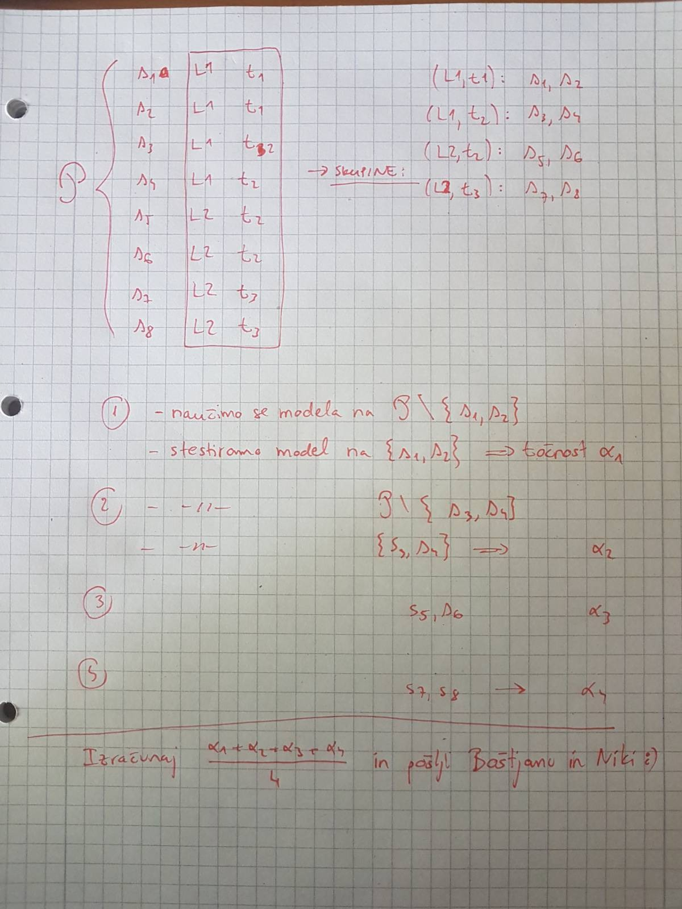

# Postopek

Vse razpoložljive podatke (npr. `imagine/prepared_data/2023-08-06-extra-features-final.tsv`) 
najprej _nekako_ razbijemo (načini so opisani spodaj) na nekaj skupin, recimo $10$. Potem se naučimo modelov:

- Slike iz ene skupine damo na stran in jih ne uporabimo za učenje, ampak le za preizkus modela. To so t. i. testne slike.
- Na slikah iz preostalih 9 skupin se naučimo modela
- Model preizkusimo na testnih slikah in izračunamo točnost.

Zgornje ponovimo tako, da vsako od 10 skupin slik enkrat proglasimo za testno skupino.
Izračunamo povprečno točnost čez vseh 10 ponovitev.

## Kako smo delili podatke včasih?

Imamo podatke s $k b s$ vrsticami, kjer je

- $k$ število kategorij (npr. $k = 4$, ko imamo kategorije `L628`, `L394`, `L455` in `19115`),
- $b$ število bazenčkov na kategorijo (npr. $b = 20$ za bazenčke `C03`, `C04`, ...) in
- $s$ število slik na bazenček (npr. $s = 5$ in `pos001`, ... ,`pos005`).

Podatki `imagine/prepared_data/2023-08-06-extra-features-final.tsv` imajo tako 400 primerov (vrstic), 
saj je $400 = 4 \cdot 20 \cdot 5$ in so $k$, $b$ in $s$ enaki 4, 20 in 5 kot v primeru zgoraj.

Slike smo včasih razbijali glede na vrednost `(kategorija, bazenček)`. Dobimo torej $k b$ skupin.
Končna točnost modelov v tem primeru je bila okoli 80%.

### Kaj smo sčasoma ugotovili

Slike bazenčkov, ki jih naredimo na isti datum, so si med seboj tako podobne, da lahko iz slike uspešno napovemo datum, 
na katerega je bila posneta (80%). To je narobe, zato jih od sedaj naprej delimo drugače.

## Kako jih deliko sedaj

Vsak sev je bil analiziran na dva datuma, zato slike razbijemo glede na vrednost `(kategorija, datum)`.
To nam da $2k$ skupin. Ko podatke delimo tako, dosežemo točnost okoli 34%.
Datuma se sploh ne da napovedati (manj kot 1%).

Nov postopek kaže tudi čudovita shema spodaj:

## Rezultati

Rezultati so shranjeni v datotekah `classification_bagging_ ...`
