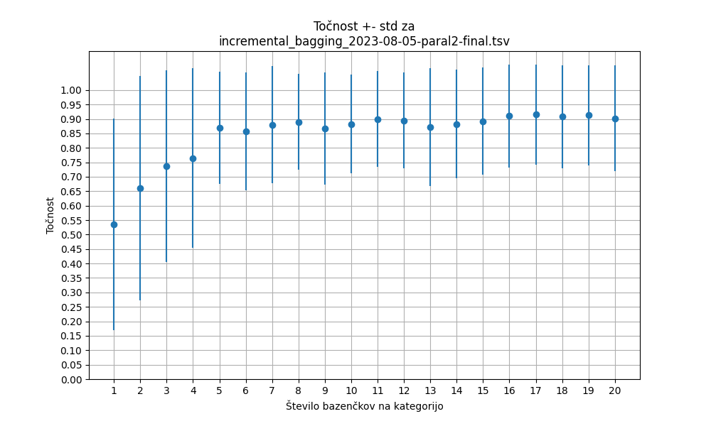
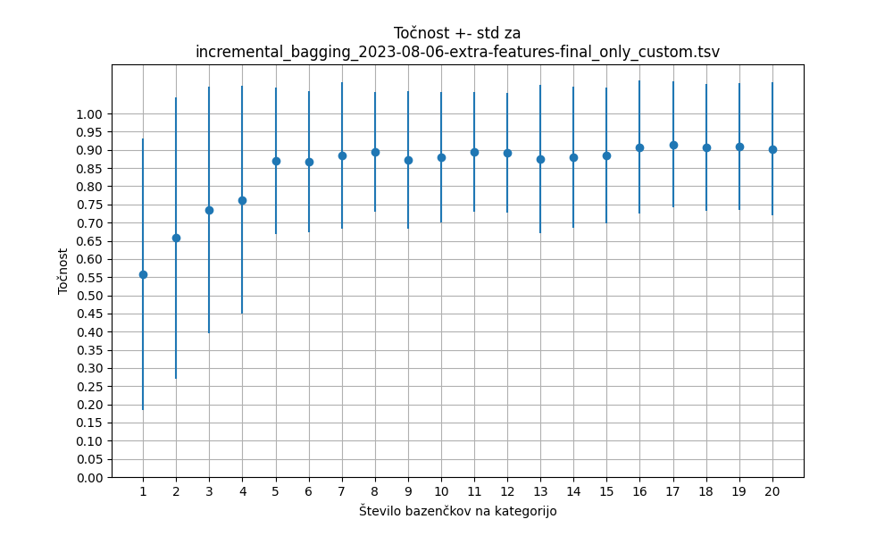
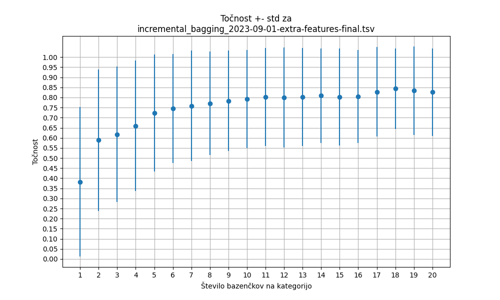

# Koliko podatkov je dovolj?

Imamo podatke s $k b s$ vrsticami, kjer je

- $k$ število kategorij (npr. $k = 4$, ko imamo kategorije `L628`, `L394`, `L455` in `19115`),
- $b$ število bazenčkov na kategorijo (npr. $b = 20$ za bazenčke `C03`, `C04`, ...) in
- $s$ število slik na bazenček (npr. $s = 5$ in `pos001`, ... ,`pos005`).

Podatki `imagine/prepared_data/2023-08-06-extra-features-final.tsv` imajo tako 400 primerov (vrstic), saj je $400 = 4 \cdot 20 \cdot 5$ in so $k$, $b$ in $s$ enaki 4, 20 in 5 kot v primeru zgoraj.

Zanima nas, kolikšna je najmanjša vrednost $b$, ki še vodi do dobrih modelov za napovedovanje kategorije.

## Gradnja modelov

- Slike iz enega bazenčka damo na stran in jih ne uporabimo za učenje, ampak le za preizkus modela. To so t. i. testne slike (torej $s$ slik, tj. $5$ slik v primeru zgoraj).
- Na preostalih slikah se naučimo naslednje modele:
    - Model, ki ga dobimo, ko uporabimo le en bazenček na kategorijo (torej $ks$ slik, tj. 20 slik v primeru zgoraj).
    - Model, ki ga dobimo, ko uporabimo dva bazenčka na kategorijo (torej $2ks$ slik, tj. 40 slik v primeru zgoraj).
    - Model, ki ga dobimo, ko uporabimo tri bazenčke na kategorijo (torej $3ks$ slik, tj. 60 slik v primeru zgoraj).
    - ...
    - Model, ki ga dobimo, ko uporabimo $b - 1$ bazenčkov na kategorijo (torej $(b - 1)ks$ slik, tj. 380 slik v primeru zgoraj).
    - Model, ki ga dobimo, ko uporabimo **_vse_** bazenčke na kategorijo (torej $bks - s$ slik, tj. 395 slik v primeru zgoraj - glej opombo).
- Vse modele iz prejšnje točke preizkusimo na testnih slikah.

Postopek zgoraj ponovimo za vse možne izbire testnih slik in izračunamo povprečno vrednost točnosti
modela pri danem številu bazenčkov.

**Opomba:** ko gradimo modele iz vseh bazenčkov, ima ena od kategorij na voljo en bazenček manj
(saj je bil en bazenček namenjen preizkusu modela).

## Rezultati

Rezultati so shranjeni v datotekah `.tsv` ter izrisani na spodnjih grafonih:

